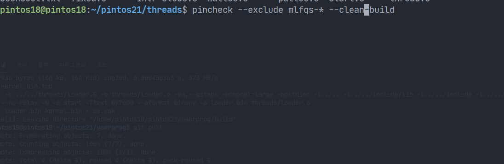
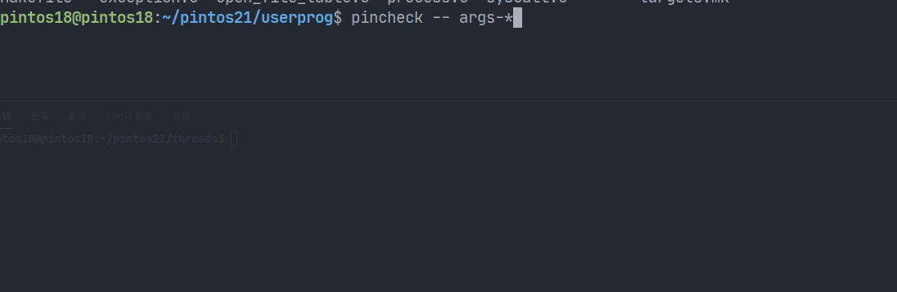
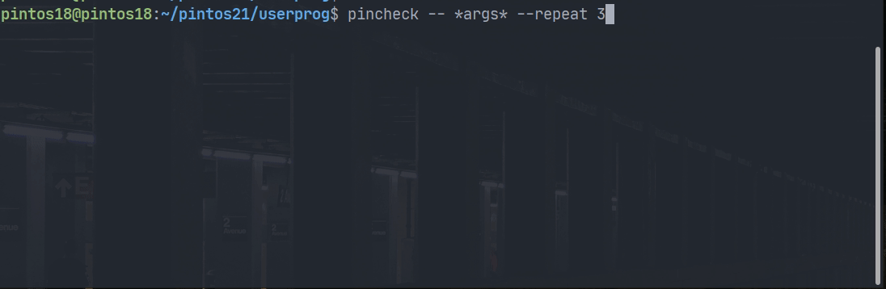
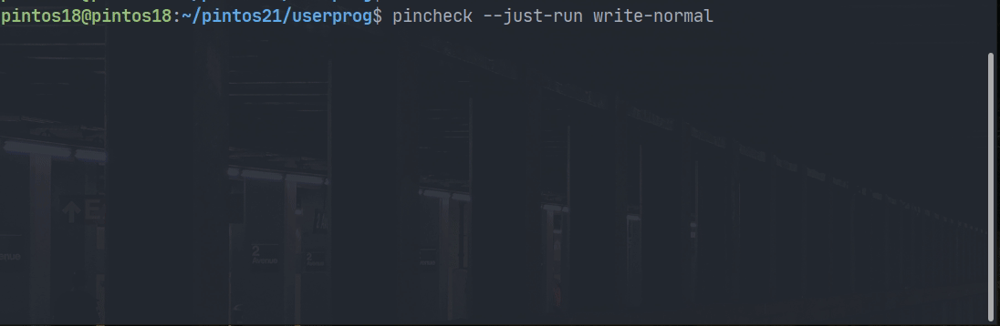
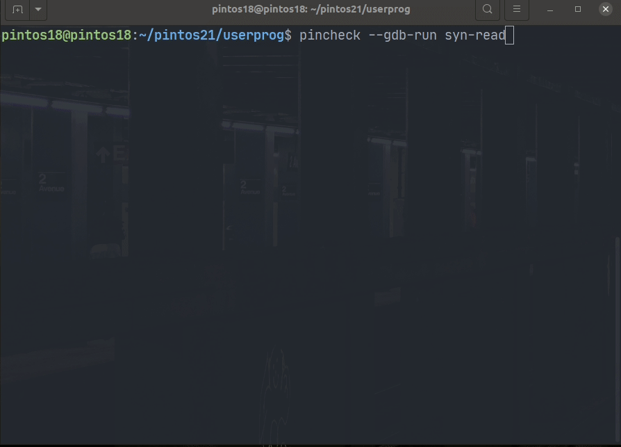
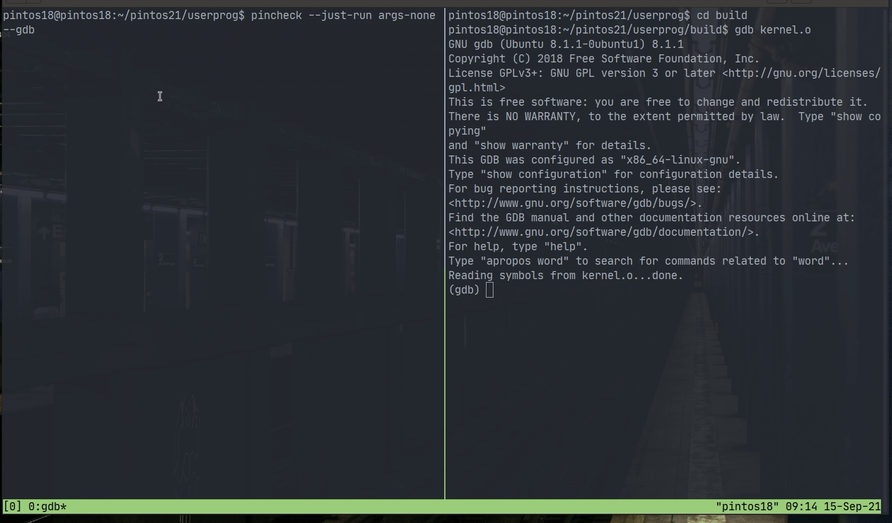

# Pincheck KAIST

Parallel testing for [casys-kaist/pintos-kaist](https://github.com/casys-kaist/pintos-kaist) projects
... with several features.



## Index

- [README](#readme)
- [Acknowledgement](#acknowledgement)
- [Features](#features)
  - [Testing](#testing)
  - [Running](#running)
  - [Debugging](#debugging)
- [Usage](#usage)
  - [Testing](#for-testing)
  - [Running](#for-running)
  - [Debugging](#for-debugging)
- [Benchmarks](#benchmark-with-all-passing-implementation)
- [Prerequisites](#prerequisites)
- [Installation](#installation)
- [Update](#update)

## README

- As this utility is still in progress to complete, there would be many errors, bugs, or
  glitches. Share your bad experiences with `pincheck` if any, through KLMS or Github issues tab.
- The original `make check` command is always more accurate.
- If you give `-j` option to be much higher than the number of machine's cores,
some test cases might be failed even if it is correct.
- This tool doesn't work with original Pintos.

## Acknowledgement

- [ikalnytskyi/termcolor](https://github.com/ikalnytskyi/termcolor)
- [p-ranav/argparse](https://github.com/p-ranav/argparse)

## Features

### Testing



- Test using **multi-threads**, with more **visual cues**
- **Test target filtering** with wildcards (`*`, `?`)
- Running test of **any project** in **any path**



- **Repeating** the whole checking process multiple times

### Running



- **Running one case** to see only the output, but with additional **`backtrace` detection**

### Debugging



- **Embedded GDB REPL;** you don't need to make 2 terminal windows nor type `target remote localhost:1234`

## Usage

### For testing

```sh
# Run tests of threads project
pintos-kaist/src/threads$ pincheck

# Run tests of userprog project (can be executed in other directories)
$ pincheck -p userprog

# Run tests with 3 parallel test pool
# The default value is the number of hardware cores(threads)
pintos-kaist/src/threads$ pincheck -j 3

# Run "alarm-single" test only
pintos-kaist/src/threads$ pincheck -- alarm-single

# Run tests whose names have "alarm-" or "priority-" prefix
pintos-kaist/src/threads$ pincheck -- alarm-* -- priority-*

# Run tests except the tests with "mlfqs" prefix
pintos-kaist/src/threads$ pincheck --exclude mlfqs*

# Run tests which belong to "...../mlfqs" test subdirectory
pintos-kaist/src/threads$ pincheck --subdir */mlfqs

# Run tests which don't belong to "...../mlfqs" test subdirectory
pintos-kaist/src/threads$ pincheck --subdir-exclude */mlfqs

# Run tests in decreasing order of TIMEOUT, which may make the whole process faster
pintos-kaist/src/userprog$ pincheck --sort

# Run tests after cleaning build directory
pintos-kaist/src/vm$ pincheck --clean-build

# Repeat the whole tests 5 times
pintos-kaist/src/filesys$ pincheck --repeat 5

# Run with verbose
$ pincheck --verbose

# version & help
$ pincheck --version
$ pincheck --help
```

### For running

```sh
# Just run to see the outputs and possible backtraces
$ pincheck --just-run alarm-single

# You can pass as the full path, too.
$ pincheck --just-run tests/userprog/dup2/dup2-complex

# Just run, but with its timeout option
$ pincheck --just-run multi-oom --with-timeout

# Just run, but with --gdb option
$ pincheck --just-run syn-read --gdb
```

This is the example running for `--gdb` option:



### For debugging

```sh
# GDB REPL
$ pincheck --gdb-run write-normal
```

## Benchmark with all passing implementation

### `threads`

On KCloud VM (2 cores, 4GB RAM, 100GB Storage, Ubuntu 18.04)

- `make check` : 842 seconds
- `make check -j 2` : 423 seconds
- `pincheck (-j 2)` : 426 seconds
- 1 MLFQS test failed for both `make` and `pincheck` with `-j 3` or more.

On my VirtualBox (VM with 4 cores, 8GB RAM, 20GB Storage, Ubuntu 18.04)

- `make check` : 901 seconds
- `make check -j 4` : 227 seconds
- `pincheck (-j 4)` : 227 seconds
- `make check -j 5` : 197 seconds
- `pincheck -j 5` : 197 seconds

Note that the longest test to finish (`mlfqs-recent-1`) takes about 190 seconds.

### `userprog` (including `dup2`)

On KCloud VM (2 cores, 4GB RAM, 100GB Storage, Ubuntu 18.04)

- `make check` : 192 seconds
- `make check -j 2` : 99 seconds
- `pincheck (-j 2)` : 108 seconds
- `make check -j 3` : 90 seconds
- `pincheck -j 3` : 99 seconds

On my VirtualBox (VM with 4 cores, 8GB RAM, 20GB Storage, Ubuntu 18.04)

- `make check` : 181 seconds
- `make check -j 4` : 64 seconds
- `pincheck (-j 4)` : 65 seconds
- `pincheck (-j 4) --sort` : 49 seconds
- `make check -j 5` : 58 seconds
- `pincheck -j 5` : 64 seconds
- `make check -j 8` : 56 seconds
- `pincheck -j 8` : 57 seconds
- `pincheck -j 8 --sort` : 52 seconds

## Prerequisites

**Please read carefully.**

### GCC 8.3.0 or later

Any C++ compiler that supports C++17 well with file system library would be enough.
Here shows how to configure `g++-8`, for example, on an Ubuntu 18.04 instance of KCloud VM.

```sh
# on Ubuntu 18.04 or later
$ sudo apt update
$ sudo apt install g++-8 # or later
$ sudo update-alternatives --display g++
# if no alternatives for g++ found, run this
$ sudo update-alternatives --install /usr/bin/g++ g++ /usr/bin/g++-8 40

$ sudo update-alternatives --display c++
# if no alternatives for c++ found, run this
$ sudo update-alternatives --install /usr/bin/c++ c++ /usr/bin/g++ 40

# version check
$ c++ --version
```

If you don't want to use `update-alternatives`, please change the value of `CC` in `Makefile` from `c++` to `g++`, `g++-8`, or etc.

### `pintos` in `PATH` variable

The pintos utils directory MUST BE registered in `PATH` environment variable in advance, as `pincheck` detects your pintos project directory by executing `which pintos` command.

```sh
# write following in .bashrc
# or execute manually in advance
source (pintos directory)/activate
```

If you use KCloud VM, it is likely to be something like `/root/pintos-kaist` or `/home/<your id>/pintos-kaist`.

```sh
source /root/pintos-kaist/activate
# or
source /home/<your id>/pintos-kaist/activate
```

Afterwards, you should get output by running `which pintos` on the shell. If nothing printed, please read above carefully.

### CPU with 2+ cores recommended

## Installation

**Please read carefully.**

First, clone this repo somewhere and make build.

```sh
$ git clone https://github.com/xcxcmath/pincheck-kaist

$ cd pincheck-kaist
$ make

# or if you want to utilize dual(2)-core CPU for compiling,
$ make -j 2
```

Then you can use `pincheck` executable anyway:

```sh
<dir of pincheck-kaist>/build/pincheck -p filesys
```

You may also want to run it shortly. One of the options is copying `pincheck` into pintos' utils directory.

```sh
# Option 1) copying executable to pintos utils directory
# The pintos utils path must be registered to PATH

# Makefile automatically detects the pintos utils directory:
$ make install
# or you can copy manually:
$ cp build/pincheck /home/<your name>/pintos-kaist/utils
```

In this case, if you are using git for your project, you may add `pincheck` to `.gitignore`. If `Cannot find pintos` message appears when running `make install`,
please check whether you can run command `pintos`.

Another option is editing `PATH` in `.bashrc` adding the build directory.

```sh
# Option 2) adding the build directory to PATH
# in ~/.bashrc
export PATH="$PATH:(dir of pincheck-kaist)/build"
```

## Update

```sh
pincheck-kaist$ git pull
pincheck-kaist$ make install
```
